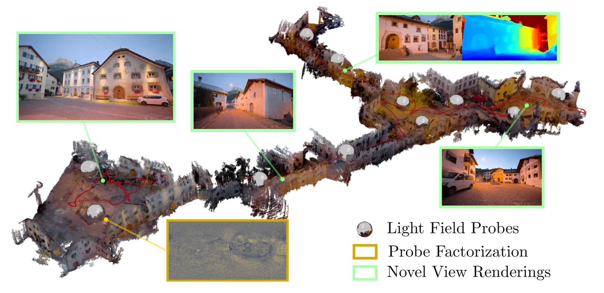
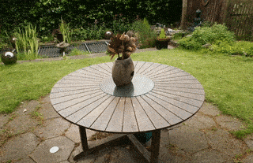

<!-- # NeLF-Pro -->
<!-- [[Project Page]](https://sinoyou.github.io/nelf-pro/) -->
<p align="center">
<h1 align="center">NeLF-Pro: Neural Light Field Probes</h1>
<h3 align="center"><a href="https://sinoyou.github.io/nelf-pro/">Project Page</a></h3>
</p>
<p align="center">
    
</p>

<p align="center">
  
  
  
  
</p>

<!-- The implementation of NeLF-Pro: Neural Light Field Probes.  -->

# Quickstart

The repo is developed on top of [sdfstudio](https://github.com/autonomousvision/sdfstudio) and [nerfstudio](https://github.com/nerfstudio-project/nerfstudio) with simplification. As the framework has frequent updates, we suggest creating a new local environment from scratch. 

## 1. Installation: Setup the environment

### Prerequisites

CUDA must be installed on the system. This library has been tested with version 11.3. You can find more information about installing CUDA [here](https://docs.nvidia.com/cuda/cuda-quick-start-guide/index.html).

### Clone Project

```bash
git clone --branch main https://github.com/sinoyou/nelf-pro.git
cd nelf-pro
```

### Create environment

The repo requires `python >= 3.7`. We recommend using conda to manage dependencies. Make sure to install [Conda](https://docs.conda.io/en/latest/miniconda.html) before proceeding.

```bash
conda create -p ./venv -y python=3.8
conda activate ./venv
python -m pip install --upgrade pip
```

### Dependencies

Install pytorch with CUDA (this repo has been tested with CUDA 11.3). 

```bash
pip install torch==1.12.1+cu113 torchvision==0.13.1+cu113 -f https://download.pytorch.org/whl/torch_stable.html
```

### Installing Simplified SDFStudio Framework

```bash
pip install --upgrade pip setuptools
pip install -e .
ns-install-cli # install tab completion (optional)
```

## 2. Prepare Dataset 

NeLF-Pro uses the datasets from the following sources for training and evaluation. 

- 360_v2[1]: [http://storage.googleapis.com/gresearch/refraw360/360_v2.zip](http://storage.googleapis.com/gresearch/refraw360/360_v2.zip)
- Free Dataset[2]: [https://www.dropbox.com/sh/jmfao2c4dp9usji/AAC7Ydj6rrrhy1-VvlAVjyE_a?dl=0](https://www.dropbox.com/sh/jmfao2c4dp9usji/AAC7Ydj6rrrhy1-VvlAVjyE_a?dl=0)
- Bungee NeRF[3]: [https://drive.google.com/file/d/1VkDerpfPhBuKmj3XewOzpGihKhOKSJaX/view?usp=drive_link](https://drive.google.com/file/d/1VkDerpfPhBuKmj3XewOzpGihKhOKSJaX/view?usp=drive_link)
- Scuol: download [video](https://www.youtube.com/watch?v=kpXiVSmvbKg&t=1s) and use `ns-process-data` to process it.
- KITTI360-Big[4]: refer to [this](./docs/kitti360_big_prepare.md) for extracting the partition. 

## 3. Training Your Model 

You can find model configurations in the folder `conf/`. Depending on the scale and geometry in each dataset, there are some minor differences on data processing, initial sampling and frequency. 

The following code examples is training the `stair` scene in `free` dataset. The default scene in 'conf/small/free.yaml' is `stair`, you can change the data path for other scenes. 

You can start the training with the following command:

```python
ns-train nelf-pro-small --trainer.load-config ./conf/small/free.yaml
```

The above command is for small scene (e.g. free and 360). For large scale scenes (e.g. scuol, kitti360-big, 56Leonard), please use the following command.

```python
ns-train nelf-pro-large --trainer.load-config ./conf/large/scuol.yaml
```

> :warning: We strongly suggest NOT to use `ns-train` in the argument fusion mode (see the following example). Due to the implementation of the framework, the followed arguments may be overwritten by the YAML config. Please generate a complete YAML config and load all arguments from it. 

```python
# This is NOT recommended. 
# Passing arguments to ns-train in a fusion mode. 'num_basis=128' will be overwritten by `num_basis=64` in YAML config. 
ns-train nelf-pro-small --trainer.load-config xxx.yaml --trainer.pipeline.model.num_basis 128
```

## 4. Evaluation, Viewing, Rendering and Exporting 

Before evalution/viewing/rendering/exporting, please add the directory path of checkpoints to YAML config. 
```yaml
trainer:
    load_dir: /path/to/checkpoint/directory 
    # e.g. ./outputs/free/date_time/models
```

### Evaluation

Simply run

```python
ns-eval --load-config ./conf/small/free.yaml 
```

### Viewer and Rendering

The used framework version doesn't support starting viewer independently. Instead, we use `ns-train` to start it. 

Change `vis` from `wandb` to `viewer` in YAML config (`load_dir` should also be specified). Then run the following command to start nerfstudio viewer. 

```python 
ns-train nelf-pro-small --trainer.load-config ./conf/small/xxx.yaml
```

After obtaining the exported rendering path from the viewer, we can render the sequence:

```python
ns-render --load-config ./conf/xxx.yaml --traj filename --camera-path-filename /path/to/path.json --output-path renders
```

### Exporting

The method supports exporting dense point clouds from depth maps. For example, 

```python
ns-export pointcloud --load-config ./conf/xxx.yaml --output_dir ./point3d/
```

## 5. Use Customized Dataset

Please refer to [ns-process-data](https://docs.nerf.studio/reference/cli/ns_process_data.html) and convert the original data into nerfstudio dataset format. The `./conf/customized_template.yaml` provides a basic skeleton and comments to train on the customized dataset. 

Please carefully consider the following arguments when training on customized dataset. These arguments are mainly related to initial sampling, which can greatly influence the convergence and reconstruction. 

```yaml
pipeline:
    datamanager: 
        dataparser: 
            auto_scale_poses: bool, whether to rescale all camera positions into unit box. 
    model:
        near_plane: float, the closest possible sampling distance. 
        far_plane: float, the farthest possible sampling distance. 
        init_sampler: str, the initial sampling function. 
```

# Dev Introduction

The code is based on [SDFStudio](https://github.com/autonomousvision/sdfstudio) and [NeRFStudio](https://github.com/nerfstudio-project/nerfstudio), the basic knowledge about the framework is necessary for further development. 

The method implementation is mainly within the `nerfstudio/` folder. Specifically, it could be divided into following parts. 

### Method
`nerfstudio.models.nelfpro` contains the method's main logistics including rendering, loss computing, evalutaion. `nerfstudio.fields.nelfpro_field` contains the implementation of estimating density and color from query points. 

```bash
./
|-- nerfstudio
|   |-- models
|   |   |-- nelfpro.py
|   |   |-- ...
|   |-- fields
|   |   |-- nelfpro_field.py
|   |   |-- ...
|   |-- ...
```

### Data

`nerfstudio.data.dataparser.nelfpro_dataparser` processes the data from different raw loaders and generate the locations of core probe factors and basis probe factors. `nerfstudio.data.dataparser.raw_dataset_loader.xxx_raw_loader.py` is responsible for parsing the raw datasets and convert them to a unified format. 

```bash
./
|-- nerfstudio
|   |-- data
|   |   |-- dataparsers
|   |   |   |-- raw_dataset_loader
|   |   |   |   |-- llff_dataset_raw_loader.py
|   |   |   |   |-- xxx_raw_loader.py
|   |   |   |-- nelfpro_dataparser.py
|   |   |   |-- ...
|   |   |-- ...
|   |-- ...
```

### Scripts

The folder `scripts/` contains many useful scripts on training, evaluation, exporting and data processing. You can find the correspondence between the scripts and nerfstudio CLI in the `pyproject.toml`. 

```bash
./
|-- scripts
|   |-- eval.py
|   |-- exporter.py
|   |-- render.py
|   |-- train.py
|   |-- process_data.py
|   |-- ...
|-- ...
```

# Acknowledgment

The repo is built on [SDFStudio](https://github.com/autonomousvision/sdfstudio) and [NeRFStudio](https://github.com/nerfstudio-project/nerfstudio). Some codes are inspired by [TensoRF](https://github.com/apchenstu/TensoRF) and [BungeeNeRF](https://github.com/city-super/BungeeNeRF). 

# Reference
[1] Mip-nerf 360: Unbounded anti-aliased neural radiance fields.

[2] F2-NeRF: Fast Neural Radiance Field Training with Free Camera Trajectories.

[3] Bungeenerf: Progressive neural radiance field for extreme multi-scale scene rendering.

[4] KITTI-360: A novel dataset and benchmarks for urban scene understanding in 2d and 3d. 

# Citation 

If you find this repo useful, please cite

```
@article{You2023NeLF-Pro,
  author    = {You, Zinuo and Chen, Anpei and Geiger, Andreas},
  title     = {NeLF-Pro: Neural Light Field Probes},
  journal   = {Coming Soon},
  year      = {2023},
}
```